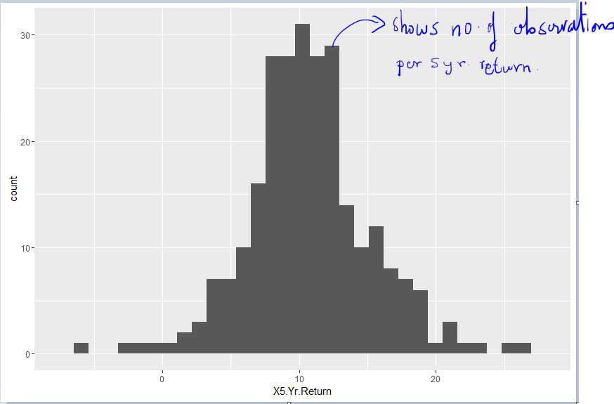

```{r setup, include=FALSE}
knitr::opts_chunk$set(echo = TRUE)
```

## The goal

In my quest to learn practical econometrics, I found that statistics and data analysis are very important to understand. Understanding the data and what it tries to tell you will be discussed here in the context of the book "Statistics for Managers using Microsoft Excel". In this cool book are several concepts which I will reproduce in this blog using the programming language R. I will then continue this blog thru several other topics like the R programming language itself, econometrics, time series analysis, numerical methods, machine learning and differential equations. Of course I intend to explain not to you but to myself the meaning of data, how to engineer it using examples which I deem sensible. I may even touch on the subject of derivatives if I have time in this lifetime. I will then transform this blog into a book. 

It is a massive undertaking and will consume most of my remaining life. I therefore hope to complete this book before I am layed to rest.

This book will contain a mash up of several books I have studied and still studying on the subjects mentioned above. There will be examples thrown all over based on datasets from the reference books I am using.

In this first chapter lets learn how to display and interpret data using some common display tools using R. Lets use the Mutual Funds.xls data which contains data on 259 mutual funds with some qualitative information on the fund type, objectives and risk buckets but also gives some quantitative performance metrics like 3 Year and 5 Year returns and best and worst quarter returns.

Lets start our journey into understanding data with the simplest plot for quantitative information which is the stem and leaf plot. 

### Stem and Leaf plot

The stem and leaf plot is a simple plot which separates the data entries into leading digits or stems and trailing digits or leaves. The plot basically shows how the values distribute and cluster over the range of the observations in the data set.

In R there is a function called stem which is very suitable to display this data. It takes in 4 arguments out of which the first 2 are the most important. The first argument is an ordered vector of a variable and the second argument controls the height of the plot.

```{r}
library(xlsx)

mf_return <- read.xlsx(file = "./data/Mutual Funds.xls", sheetName = "Data")
head(mf_return)


# Order the 5 Year returns of the 259 Mutual funds
mf_order_5yr_return <- mf_return$X5.Yr.Return[order(mf_return$X5.Yr.Return)]

mf_order_5yr_return

stem(mf_order_5yr_return, scale= 2)

```

#### Interpretation

There are 4 mutual funds delivering -ve returns and 7 delivering returns > 20%. Most of the funds have returns between 8% to 12% returns. 

#### What is the stem and leaf graph good for

- It separates each data into groups: **Separation**
- It shows asymmetry in the data: **Assymetry**
- It visually shows irregularities: **Irregularities**
- It shows where most of the data is centered: **Centering**


#### What does the stem and leaf graph not tell you

1. Its not easy to visualize categorical plots. For example if one wants to visualize the 5 year returns based on mutual fund objectives

```{r}
head(mf_return)

#Get the levels of the Objectives: Growth and Value
levels(mf_return$Objective)


temp <- mf_return$X5.Yr.Return[mf_return$Objective %in% "Growth"]
(mf_return_5Yr_Growth <- temp[order(temp)])

temp <- mf_return$X5.Yr.Return[mf_return$Objective %in% "Value"]
(mf_return_5Yr_Value <- temp[order(temp)])

stem(mf_return_5Yr_Growth, scale=2)

stem(mf_return_5Yr_Value, scale=2)

```

You see that its not visually easy to compare the two plots.

2. The stem and leaf plots are fine for small data sets. Its better to use histograms for larger datasets.
3. For large data sets the center of the distribution is not clearly visible.


### Histogram

When there are a large number of observations, its useful to summarise the data using a histogram. A histogram is used to describe numerical data that have been grouped into frequency, relative frequency or percentage distributions. The variable of interest is plotted along the x axis grouped in intervals and the number of or percentage or proportion is plotted along the y axis.

Lets now construct a histogram of the 5 year returns of mutual funds data. 

```{r, fig.keep="none"}
library(ggplot2)

ggplot(mf_return, aes(X5.Yr.Return)) + geom_histogram()


```




What about a bar plot? The bar plot will plot eaach and every point of the data rather than binning the data in ranges.

```{r, fig.keep="none"}

ggplot(mf_return, aes(X5.Yr.Return)) + geom_bar()

```


